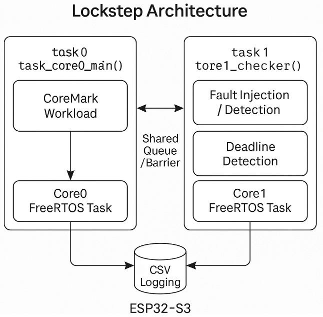
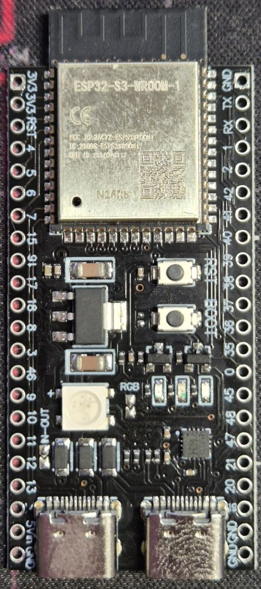
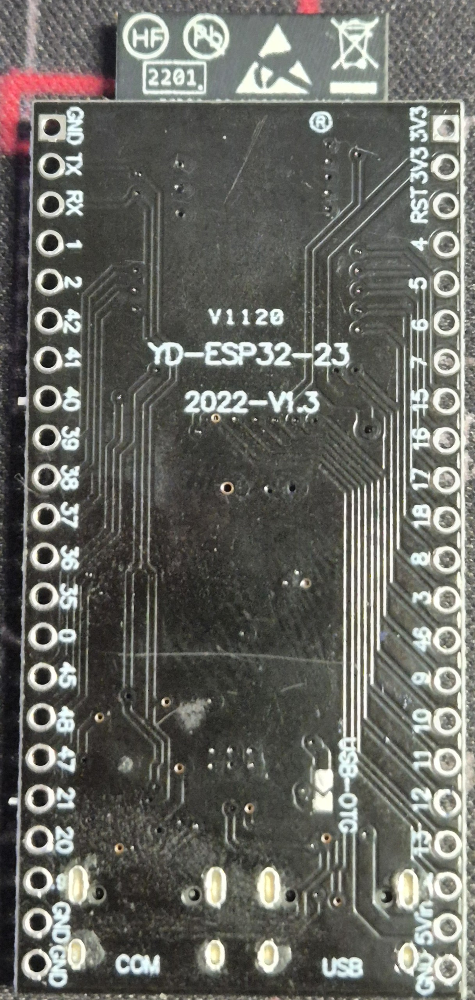
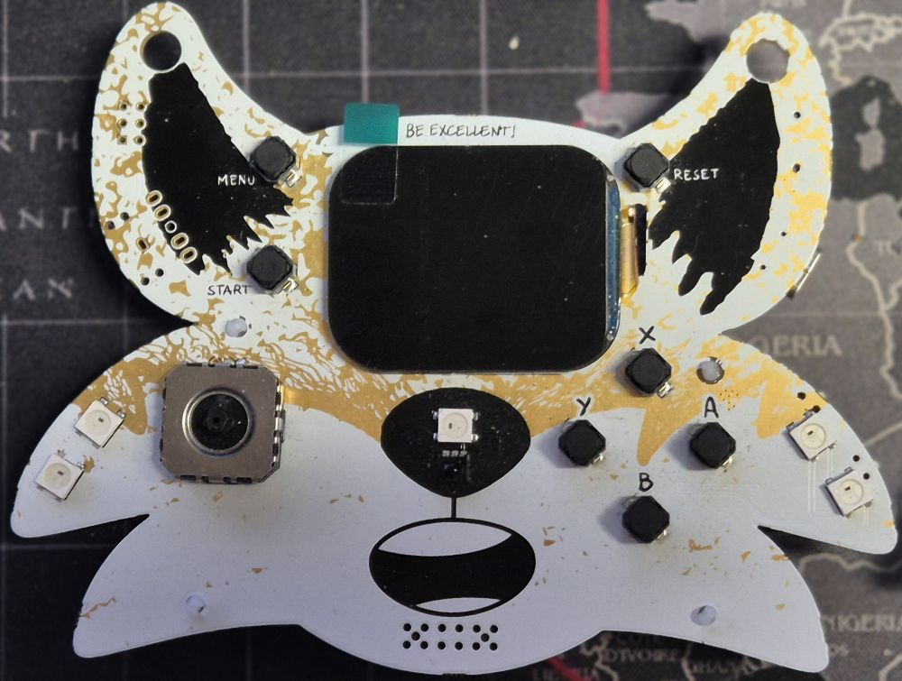
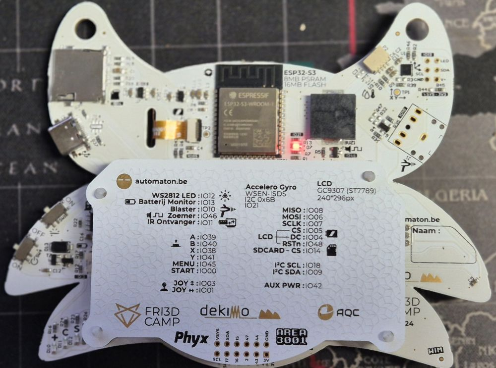
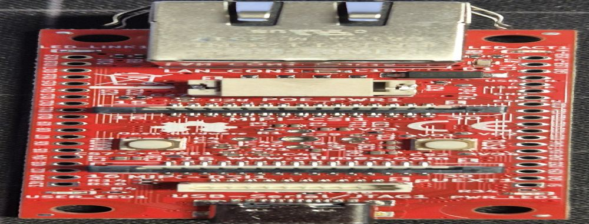
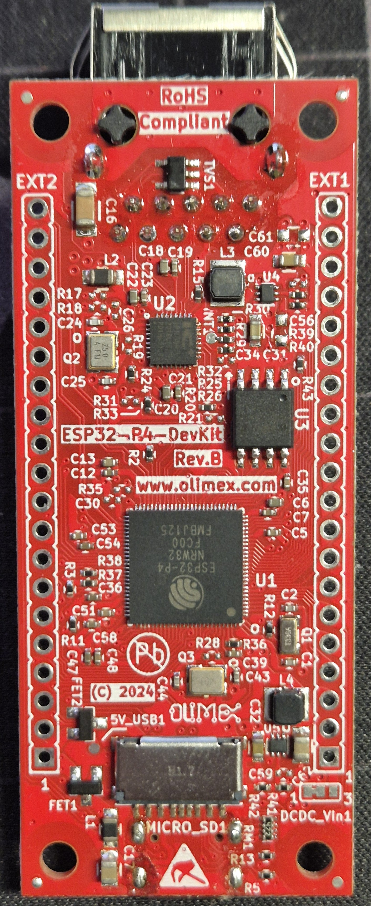

# ESP32 Lockstep Benchmark

🚀 **Multicore benchmark en lockstep-checker op ESP32-S3**, gebouwd met FreeRTOS en ESP-IDF.  
Ontworpen voor betrouwbaarheidsexperimenten en foutdetectie via lockstep-controle.

---

## 📂 Structuur

| Map                        | Beschrijving                                                        |
|---------------------------|---------------------------------------------------------------------|
| `01_esp_lockstep_minimal/`        | Minimale multicore setup met eenvoudige synchronisatie             |
| `02_enhanced_lockstep/`           | Uitgebreide versie met timing-analyse, CSV-logging en checker      |
| `03_enhanced_lockstep_final/`     | Final versie met gescheiden modules, metadata en CSV-logging       |

---

## ⚙️ Features



- Twee parallelle taken op Core0 en Core1
- CoreMark-stub als benchmark workload
- Synchronisatie via FreeRTOS queues of barriers
- Realtime timing-analyse en CSV-logging
- Lockstep mismatch- en deadline-analyse
- Board metadata logging voor traceerbaarheid

---

## 📋 Benodigdheden

- ✅ ESP32-S3 DevKit (getest op DevKitC & Fri3d board)
- ✅ ESP-IDF v5.5 (compatibel met ESP32-S3)
- ✅ Python 3.11 (voor de ESP-IDF toolchain)
- ✅ USB-UART verbinding (115200 baud)
- ✅ Windows PowerShell of Git Bash met ESP-IDF omgeving geactiveerd

---

## 🔧 Build & Flash

```bash
# Navigeer naar een submap (bijvoorbeeld de enhanced versie)
cd 02_enhanced_lockstep

# Configureer target en project
idf.py set-target esp32s3
idf.py menuconfig

# Compileer project
idf.py build

# Flashen en monitoren
idf.py -p COM6 flash monitor
```
⚠️ Pas COM6 aan naar de seriële poort van jouw DevKit op Windows.

---

## 📈 CSV Output

Bij het uitvoeren van de benchmarks krijg je regelmatige CSV-output zoals:

```
CSV,seq,ref_score,chk_score,delta,duration_us,deadline,match  
CSV,15,2521830716,2521830716,0,1064,OK,OK
```

Deze kun je opslaan en analyseren in Python, Excel, of andere analysetools.  
Handig voor visualisatie van betrouwbaarheid, timing en foutdetectie.

---

## 📷 Hardware foto's

### ESP32-S3 DevKitC


[specs](https://www.amazon.nl/dp/B0D6B2CYNW)

### Fri3d Badge 2024


[specs](https://github.com/Fri3dCamp/badge_2024_hw)

### ESP32WROOM32 ontwikkelbord (Wemos)


[specs](https://wiki.geekworm.com/WEMOS_ESP32_Board_with_OLED)

### ESP32WROOM32 ontwikkelbord (Joy-it)


[specs](https://joy-it.net/en/products/SBC-NodeMCU-ESP32)

### ESP32WROOM32 ontwikkelbord (Otronic)


[specs](https://www.otronic.nl/nl/esp32-wroom-4mb-devkit-v1-met-losse-header-pins.html)

### ESP32-P4 DevKit (Olimex)


[specs](https://www.olimex.com/Products/IoT/ESP32-P4/ESP32-P4-DevKit/open-source-hardware)

---

## 🖼️ Voorbeeld output of architectuur


---

## 🪪 Licentie

MIT License — vrij te gebruiken, aan te passen en te delen.  
Zie het bestand [`LICENSE`](./LICENSE) voor details.

---

## 📫 Feedback of bijdragen?

👋 Pull requests zijn welkom!  
Of open gerust een [Issue](https://github.com/SergeHanssens/esp32-lockstep-benchmark/issues) bij vragen, bugs of suggesties.
